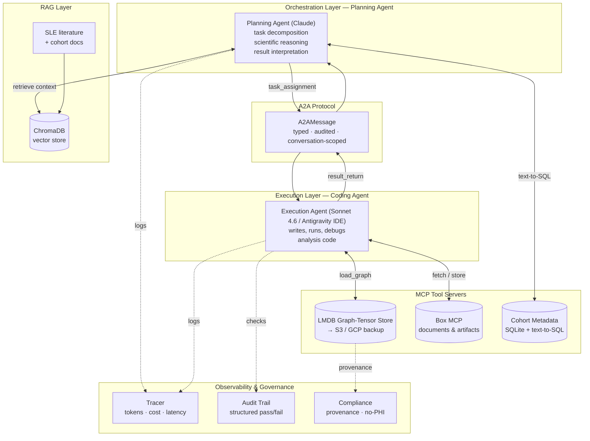
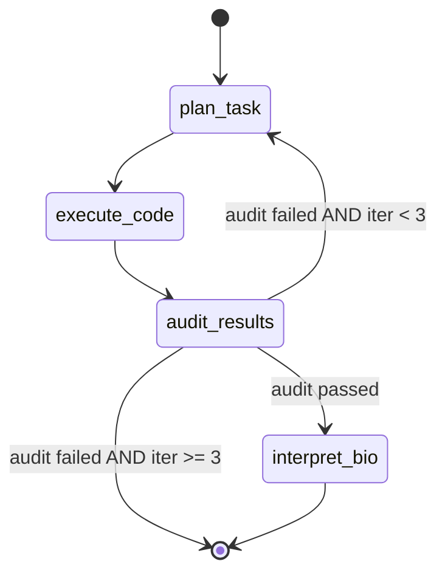

# iMEMORY Agentic Platform

**An agentic orchestration framework for machine learning in computational biology.**

This repository demonstrates the multi-agent infrastructure that powers iMEMORY, a deep-learning target-discovery platform for myeloid-driven inflammatory disease. It implements a planning agent and an execution agent that communicate over a formal Agent-to-Agent (A2A) protocol, call MCP-compliant tool servers (Box, an LMDB graph-tensor store), retrieve domain context through a biomedical RAG pipeline, and run under a LangGraph state machine with full observability and governance instrumentation.

> **Scope and IP note.** This is a public showcase of the *orchestration framework* — agent code, the A2A message contract, tool definitions, control flow, and observability. It does **not** contain the proprietary iMEMORY model weights, any patient-level data, or the IAB-001 chemical structure. The demo runs entirely on **synthetic SLE transcriptomics data** generated to match the *structure* (not the contents) of public cohort schemas. No PHI is present anywhere in this repository.

---

## Why this exists

iMEMORY's research workflow is itself agentic. A **planning agent** reasons about the scientific question, decomposes it into analysis tasks, and interprets results biologically. An **execution agent** — in production, a Sonnet-class coding agent attached to the iMEMORY codebase in an IDE — writes, runs, and debugs the analysis code against the graph store and data. The two agents hand work back and forth over a typed protocol, every step is audited, and every model call is traced for cost and latency.

This repo formalizes that loop into infrastructure that a regulated enterprise (pharma, healthcare) could adopt: auditable agent boundaries, MCP-compliant tools, data-provenance tracking, and an observability layer that exposes the cost/reliability/latency trade-offs of running multi-agent systems in production.

---

## Architecture



The control flow is formalized as a LangGraph state machine:



The conditional `audit_results → plan_task` edge is the self-correcting feedback loop: when an analysis fails its CSV/structural checks, the planning agent revises the task and reassigns it, up to a bounded number of iterations.

---

## Repository layout

```
imemory-agentic-platform/
├── agents/
│   ├── orchestrator/planning_agent.py   # task decomposition, reasoning, interpretation
│   ├── executor/execution_agent.py      # code generation + execution (Antigravity in prod)
│   └── a2a/protocol.py  handoff.py      # typed Agent-to-Agent message contract
├── mcp/
│   ├── lmdb_mcp_server.py               # HetGAT graph-tensor store as an MCP tool
│   ├── box_mcp_server.py                # Box MCP configuration
│   └── s3_connector.py                  # LMDB snapshot sync to S3
├── rag/
│   ├── document_loader.py  chunker.py   # biomedical PDF/CSV ingest, tuned chunking
│   ├── vector_store.py  retriever.py    # ChromaDB store + Claude-context retriever
├── langraph_wrapper/
│   ├── state.py  graph.py               # AgentState + 4-node StateGraph
│   ├── nodes.py  edges.py               # node implementations + routing
├── observability/
│   ├── tracer.py  logger.py             # per-call tokens / cost / latency (JSONL)
│   └── audit_trail.py                   # structured pass/fail verification
├── governance/
│   ├── compliance_checks.py             # provenance, no-PHI, GxP-extensible
│   └── data_lineage.py                  # lineage + AI-generated SQL over cohort metadata
├── imemory/
│   ├── graph_builder.py                 # synthetic multimodal patient-graph builder
│   ├── embedding_space.py  vector_ops.py# 128-d embedding ops + target nomination
├── demo/
│   ├── demo_sle_pipeline.py             # end-to-end runnable demo (synthetic data)
│   └── demo_notebook.ipynb              # 6-cell narrated walkthrough
├── data/synthetic/generate_synthetic_cohort.py  # 79-patient synthetic CSV (no PHI)
└── tests/test_a2a.py  test_rag.py  test_observability.py
```

---

## How this maps to the role

This repository was built to demonstrate each competency in the Genentech *Senior Data Scientist, Gen AI Foundation* job description.

| Requirement ("Who You Are") | Where it is demonstrated |
|---|---|
| **RAG architectures & document optimization (chunking)** | `rag/` — `BioRAGPipeline` with a `RecursiveCharacterTextSplitter` tuned to 1000-token chunks / 200 overlap, chosen to preserve methods-section context in biomedical papers; ChromaDB vector store; a retriever that formats hits into the planning agent's system prompt. |
| **Vector and graph databases** | `mcp/lmdb_mcp_server.py` exposes the HetGAT graph-tensor store; `imemory/embedding_space.py` + `vector_ops.py` implement 128-dimensional vector similarity and nearest-target nomination; ChromaDB provides the document vector index. |
| **SQL & AI-generated SQL** | `governance/data_lineage.py` includes a text-to-SQL helper: the agent translates a natural-language cohort question into SQL executed against a SQLite metadata table, with the generated query logged for audit. |
| **LLM frameworks (LangChain, LangGraph, AWS AgentCore)** | `langraph_wrapper/` implements the orchestration as a four-node LangGraph `StateGraph`; LangChain community loaders drive `rag/`; the design is deployment-agnostic and maps directly onto AWS Bedrock AgentCore for production hosting (see *Design rationale*). |
| **MCP & A2A protocols** | `agents/a2a/` defines a typed, audited `A2AMessage` contract that every cross-agent call must use; `mcp/` exposes Box and the LMDB graph store as MCP-compliant tools. |
| **Transforming traditional ML models / API services into agentic, MCP-compliant tools** | `mcp/lmdb_mcp_server.py::to_mcp_tool_definition()` wraps a conventional graph-tensor datastore as an MCP tool an agent can call; `box_mcp_server.py` adapts a managed API into the same agent toolset. |
| **Multimodal architectures** | iMEMORY's HetGAT integrates **seven** omics modalities — transcriptomic, scRNA, methylation, chromatin, miRNA, SNP, and metabolomic — into a single heterogeneous patient graph; `imemory/graph_builder.py` shows the multimodal node/edge construction on synthetic data. |
| **Observability & performance (cost / reliability / latency)** | `observability/tracer.py` records per-call input/output tokens, estimated cost, and latency to queryable JSONL, with a `session_summary()` aggregator; `audit_trail.py` formalizes reliability checks. |
| **Enterprise governance & security; regulated industries** | `governance/` enforces data provenance and a no-PHI synthetic-data policy, with hooks documented for 21 CFR Part 11 / GxP audit extension; every agent action is required to carry a trace record. |

**Preferred qualifications:** B2B Gen-AI infrastructure (the entire platform); multimodal Gen AI (seven-modality HetGAT); security protocols (governance + audit + synthetic-data isolation); healthcare/pharmaceutical domain (SLE, lupus nephritis, transplant immunology throughout). Voice interfaces are noted on the roadmap and are not implemented here.

---

## Design rationale: Claude API over framework abstraction

The core orchestration is built directly on the Anthropic Messages API rather than on a higher-level framework's agent abstraction. This is deliberate for a regulated-industry setting. The raw API gives explicit control over every prompt, tool definition, and message that crosses an agent boundary — exactly what an auditable, GxP-extensible system needs. LangGraph is layered on top as a thin state-machine formalization: it makes the control flow (plan → execute → audit → replan) explicit and visualizable without owning the model-interaction logic. The result is portable. The agent logic depends only on the Messages API contract, so the same orchestration runs unchanged whether hosted locally, behind Box's MCP server, or on AWS Bedrock AgentCore. Framework code is a convenience layer, never a lock-in.

## A note on LMDB

LMDB in this system is **key-value graph-*tensor* storage**, not a property-graph database. Each HetGAT patient graph is serialized and stored under a `graph_id` key, memory-mapped for fast read during inference, and snapshotted to S3/GCP for durability. It is the right tool for *loading whole graph tensors quickly*. It is **not** a Cypher-style query engine. For property-graph queries over biological relationships (protein–protein interaction edges, pathway co-membership), a dedicated graph database such as Amazon Neptune or Neo4j is the natural next layer, sitting upstream of graph construction. This distinction is made explicit so reviewers are not misled about what the storage layer does.

---

## Quick start

```bash
# 1. Install
python -m venv .venv && source .venv/bin/activate
pip install -r requirements.txt

# 2. Configure
cp .env.example .env
# set ANTHROPIC_API_KEY=...   (BOX_TOKEN and AWS_* are optional, only for live MCP/S3)

# 3. Generate synthetic cohort (no PHI)
python data/synthetic/generate_synthetic_cohort.py

# 4. Run the end-to-end demo
python demo/demo_sle_pipeline.py

# 5. (optional) open the narrated walkthrough
jupyter notebook demo/demo_notebook.ipynb
```

The demo ingests a few public SLE abstracts plus the synthetic cohort into the RAG store, runs one full plan → execute → audit → interpret cycle through the LangGraph state machine on synthetic 128-dimensional embeddings, nominates example targets by embedding distance, and prints an observability summary (total tokens, estimated cost, mean latency).

---

## Model Training

The iMEMORY HetGAT is trained on a structured synthetic cohort of 220 patients across 5 clinical clusters, engineered so similar disease states cluster together in the learned 128-d embedding space:

| Cluster | Name | n | SLEDAI | Responder |
|---|---|---|---|---|
| 0 | Healthy | 60 | 0 | ✓ |
| 1 | SLEDAI 5 Responders | 50 | 5 | ✓ |
| 2 | SLEDAI 10 Responders | 40 | 10 | ✓ |
| 3 | **SLEDAI 13 Non-responders** | **30** | **13** | **✗** ← "diseased" |
| 4 | SLEDAI 13 Responders | 40 | 13 | ✓ |

The training is self-contained in **standard PyTorch only** — no `torch_geometric` required. Training runs automatically on the first pipeline invocation if no checkpoint exists, or can be run explicitly:

```bash
# Train and save checkpoint to data/checkpoints/
python -m training
```

After training (~2–4 min CPU, ~20 sec GPU), the checkpoint contains:
- **Trained W_tau projection matrices** — what makes the embedding space clinically meaningful after training
- **Pre-computed embeddings** for the diseased (SLEDAI 13 NR) and healthy clusters
- **All-patient embeddings** for the 5-cluster PCA visualization figure

The therapeutic signature (Δ = SLEDAI_13_NR centroid − Healthy centroid) is computed in this **learned** space, making the downstream LINCS screen and de novo molecule generation biologically grounded (even though the underlying values are synthetic).

> **Expected training result:** >90% validation accuracy across 5 clusters. The specific gene-level targets emerging from the inverse-projected signature are determined by the trained W_tau mathematics, not pre-specified in code.


## Environment variables

| Variable | Required | Purpose |
|---|---|---|
| `ANTHROPIC_API_KEY` | yes | Planning and execution agent model calls |
| `IMEMORY_ORCHESTRATOR_MODEL` | no | Override planning-agent model (default: a Claude Opus model) |
| `IMEMORY_EXECUTOR_MODEL` | no | Override execution-agent model (default: `claude-sonnet-4-20250514`) |
| `BOX_TOKEN` | no | Live Box MCP tool calls (demo runs without it) |
| `AWS_ACCESS_KEY_ID` / `AWS_SECRET_ACCESS_KEY` | no | S3 snapshot sync for the LMDB store |

---

## Tests

```bash
pytest tests/
```

`test_a2a.py` exercises a full message round-trip (plan → assign → execute → return → interpret). `test_rag.py` verifies chunking and retrieval on a tiny synthetic document. `test_observability.py` confirms the tracer writes well-formed records and that `session_summary()` aggregates cost and latency correctly.

---

## Status

This is a portfolio/showcase implementation. The production iMEMORY system runs the same architecture with the proprietary HetGAT model (30,742 patient graphs, seven modalities), real curated cohorts under data-use agreements, and the execution agent operating inside an IDE-attached coding environment. Those components are intentionally excluded here.
