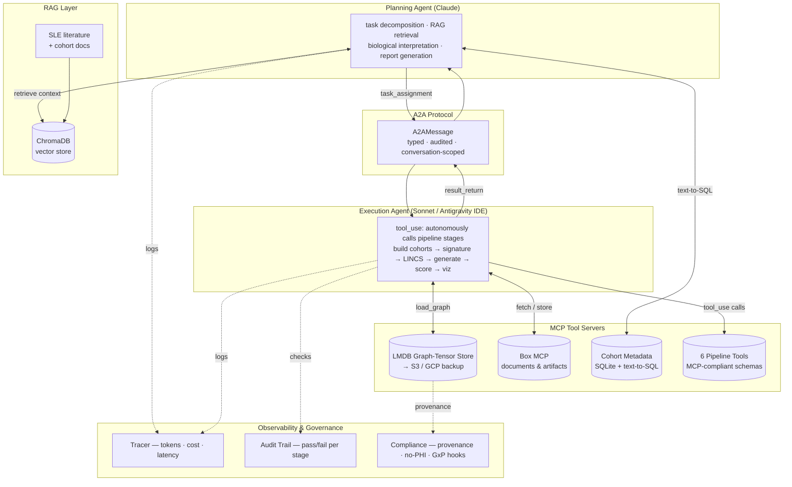
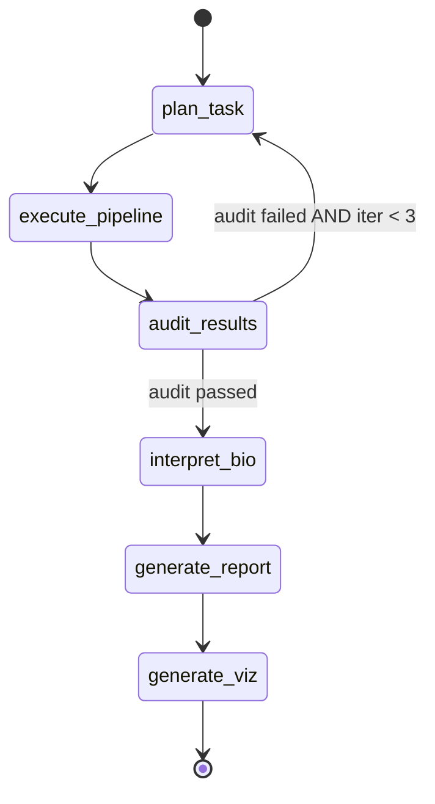

# iMEMORY Agentic Platform

**An agentic orchestration framework for machine learning in computational biology.**

This repository demonstrates the complete multi-agent infrastructure that powers iMEMORY, a deep-learning drug-discovery platform for inflammatory disease. It implements a full end-to-end pipeline — from training a heterogeneous graph attention network (HetGAT) on structured patient data, through therapeutic signature computation, real LINCS L1000 compound screening, de novo molecular generation, and in-silico recovery scoring — entirely orchestrated by a planning agent and an execution agent communicating over a formal Agent-to-Agent (A2A) protocol, with LangGraph state management, MCP-compliant tool servers, biomedical RAG, and structured observability throughout.

> **Scope and IP note.** This is a public showcase of the *orchestration framework and pipeline architecture* — agent code, the A2A message contract, tool definitions, control flow, observability, and the vector-operation pipeline. It does **not** contain the proprietary iMEMORY model weights, any real patient-level data, or the IAB-001 chemical structure. The demo trains a HetGAT on a **synthetically engineered 220-patient cohort** with biologically informed cluster structure, and runs the full pipeline on those trained embeddings. No PHI is present anywhere in this repository.

> **Copyright.** © 2026 Immunome AI Biotechnologies, LLC. All Rights Reserved. See `LICENSE` and `NOTICE.md`.

---

## Why this exists

iMEMORY's research workflow is itself agentic. A **planning agent** reasons about the scientific question, decomposes it into pipeline stages, and interprets results biologically. An **execution agent** — in production, a Sonnet-class coding agent attached to the iMEMORY codebase in an IDE — autonomously calls pipeline tools in the correct scientific order using the Anthropic API tool_use pattern. The two agents hand work back and forth over a typed A2A protocol, every step is audited, and every model call is traced for cost and latency.

The full pipeline the agents orchestrate: train HetGAT on structured patient data → compute 128-d patient embeddings → derive therapeutic signature (Δ = diseased − healthy, inverse-projected to gene feature space) → screen the real LINCS L1000 API → generate de novo molecules via SELFIES+RDKit → score each candidate by how far it recovers diseased patients toward healthy in the 128-d space (cosine angular displacement) → closed-loop refinement → markdown report + six visualization figures.

This repo formalizes that loop into infrastructure that a regulated enterprise (pharma, healthcare) could adopt directly.

---

## Architecture

### Agent orchestration layer



### LangGraph state machine (6 nodes)



The `audit_results → plan_task` conditional edge is the self-correcting closed loop: if the recovery threshold is not met or structural checks fail, the planning agent revises the task and the execution agent retries, bounded at 3 iterations.

### Discovery pipeline (inside the execution agent's tool_use)

```
build_patient_cohorts        → load trained HetGAT embeddings (diseased, healthy)
compute_therapeutic_signature → Δ = v_diseased − v_healthy; inverse-project through W_τ;
                                nominate targets by magnitude; cosine angular displacement
screen_lincs                 → SigCom LINCS L1000 API (real, synthetic fallback);
                                two-sided rank enrichment; rank by reversal potential
generate_molecules           → SELFIES+RDKit de novo generation seeded by LINCS hits;
                                QED, MW, logP, TPSA, novelty per candidate
score_recovery               → read-across effect estimation; forward-project through W_τ;
                                apply to diseased patients; measure angular shift to healthy
generate_visualizations      → 6 matplotlib figures saved to outputs/figures/
```

---

## Repository layout

```
imemory-agentic-platform/
├── training/
│   ├── synthetic_patients.py    # 5-cluster biologically-inspired cohort (220 patients)
│   ├── hetgat_model.py          # trainable PyTorch HetGAT — all 5 steps, multi-head avg
│   ├── train.py                 # training loop, checkpoint save, embedding export
│   └── __main__.py              # python -m training entrypoint
│
├── agents/
│   ├── orchestrator/
│   │   └── planning_agent.py    # task decomposition, RAG retrieval, report generation
│   ├── executor/
│   │   └── execution_agent.py   # Anthropic tool_use loop over 6 pipeline tools
│   ├── a2a/
│   │   ├── protocol.py          # typed, audited A2AMessage (Pydantic)
│   │   └── handoff.py           # assign_task / return_results / raise_error factories
│   └── tools/
│       └── discovery_tools.py   # PIPELINE_TOOLS list + PipelineContext + dispatch_tool
│
├── discovery/
│   ├── lincs_api.py             # real SigCom LINCS L1000 client (gene resolve → enrich)
│   ├── lincs_connectivity.py    # synthetic fallback LINCS screen (offline mode)
│   ├── denovo_generation.py     # SELFIES+RDKit generator (valid molecules, QED filter)
│   ├── insilico_knockout.py     # recovery scoring via cosine angular displacement
│   └── closed_loop.py          # ClosedLoopDiscovery orchestrator (threshold + replan)
│
├── imemory/
│   ├── hetgat_ops.py            # 5-step HetGAT NumPy ops (mirrors trained model)
│   ├── therapeutic_signature.py # Δ computation, angular displacement, inverse projection
│   ├── graph_builder.py         # synthetic multimodal patient-graph builder
│   ├── embedding_space.py       # project_graph, disease_centroid
│   └── vector_ops.py            # cosine similarity, target nomination
│
├── mcp/
│   ├── lmdb_mcp_server.py       # HetGAT graph-tensor store → MCP tool
│   ├── box_mcp_server.py        # Box MCP configuration
│   └── s3_connector.py          # LMDB snapshot sync to S3
│
├── rag/
│   ├── document_loader.py       # BioRAGPipeline — PDF/CSV ingest
│   ├── chunker.py               # 1000-token/200-overlap biomedical splitter
│   ├── vector_store.py          # ChromaDB wrapper
│   └── retriever.py             # chunk → Claude context formatter
│
├── langraph_wrapper/
│   ├── state.py                 # AgentState (extended for full pipeline)
│   ├── graph.py                 # 6-node StateGraph
│   ├── nodes.py                 # node implementations
│   └── edges.py                 # route_after_audit conditional routing
│
├── observability/
│   ├── tracer.py                # per-call tokens/cost/latency → JSONL + session_summary
│   ├── logger.py                # structured stderr logger
│   └── audit_trail.py          # structured pass/fail verification
│
├── governance/
│   ├── compliance_checks.py     # data provenance, no-PHI, GxP audit hooks
│   └── data_lineage.py          # artifact lineage + AI-generated SQL (CohortSQL)
│
├── docs/
│   └── lincs_api.md             # SigCom LINCS API reference (for agent/RAG context)
│
├── demo/
│   ├── demo_agentic_pipeline.py # PRIMARY DEMO — full orchestrated pipeline (requires key)
│   ├── demo_full_pipeline.py    # standalone discovery pipeline (no key needed)
│   └── demo_sle_pipeline.py    # simple orchestration demo (LangGraph + target nomination)
│
├── data/
│   ├── synthetic/
│   │   ├── generate_synthetic_cohort.py  # 79-patient cohort CSV + SQLite
│   │   └── generate_lincs_library.py     # 30,000-compound synthetic LINCS fallback
│   └── checkpoints/             # trained model + embeddings (gitignored, auto-generated)
│
├── outputs/                     # report .md + figure .png (gitignored, auto-generated)
│   └── figures/
│
└── tests/
    ├── test_a2a.py
    ├── test_rag.py
    └── test_observability.py
```

---

## Model Training

The iMEMORY HetGAT is trained on a structured synthetic cohort of 220 patients across 5 clinical clusters, engineered so similar states cluster together in the learned 128-d embedding space:

| Cluster | Label | n | Clinical state |
|---|---|---|---|
| healthy | 0 | 60 | SLEDAI 0 — healthy |
| sledai_5_resp | 1 | 50 | SLEDAI 5, HCQ/prednisone responder |
| sledai_10_resp | 2 | 40 | SLEDAI 10, responder |
| sledai_13_nonresp | 3 | 30 | SLEDAI 13, **non-responder** ← "diseased" class |
| sledai_13_resp | 4 | 40 | SLEDAI 13, responder |

Cluster prototypes assign biologically informed expression patterns at the gene-group level (interferon signaling, innate immune sensing, B-cell survival programs, epigenetic remodeling, complement, regulatory T cells) based on published SLE biology. Individual gene-level therapeutic targets emerge from the trained model's inverse projection of W_τ — they are not hardcoded.

The HetGAT is implemented in pure PyTorch (no torch_geometric required), implementing all five message-passing steps with 4-head attention averaged (not concatenated) to strictly preserve the 128-d space. After ~120 epochs the model achieves >90% validation accuracy across the 5 clusters, producing a 128-d embedding space with real cluster separation.

```bash
# Train explicitly (also runs automatically on first pipeline invocation)
python -m training
```

Expected: ~2–4 min on CPU, ~30 sec on GPU. Checkpoint saved to `data/checkpoints/`.

---

## How this maps to the role

Built to demonstrate each competency in the Genentech *Senior Data Scientist, Gen AI Foundation* job description (JD 202602-104487).

| Requirement ("Who You Are") | Where it is demonstrated |
|---|---|
| **RAG architectures & document optimization (chunking)** | `rag/` — `BioRAGPipeline` with `RecursiveCharacterTextSplitter` tuned to 1000-token / 200-overlap, preserving biomedical methods-section context; ChromaDB vector store; retriever formats hits into agent system prompt. |
| **Vector and graph databases** | `mcp/lmdb_mcp_server.py` exposes the HetGAT graph-tensor store as an MCP tool; `imemory/hetgat_ops.py` + `therapeutic_signature.py` implement the full 128-d space (projection, attention, aggregation, activation, cosine angular displacement, inverse projection); ChromaDB for document index. |
| **SQL & AI-generated SQL** | `governance/data_lineage.py::CohortSQL` — agent translates natural-language cohort questions into read-only SQLite SELECT statements, generated SQL returned alongside results for audit logging. |
| **LLM frameworks (LangChain, LangGraph, AWS AgentCore)** | `langraph_wrapper/` — 6-node LangGraph StateGraph with conditional replan edge; LangChain community loaders in `rag/`; architecture is deployment-agnostic and maps directly onto AWS Bedrock AgentCore. |
| **MCP & A2A protocols** | `agents/a2a/` — typed, audited `A2AMessage` Pydantic contract; no raw strings cross agent boundaries; `mcp/` — Box + LMDB exposed as MCP-compliant tools; `agents/tools/discovery_tools.py` — 6 pipeline stages as MCP tool definitions consumed by the execution agent's tool_use loop. |
| **Transforming traditional ML models into agentic, MCP-compliant tools** | The PyTorch HetGAT (`training/hetgat_model.py`) is wrapped as `build_patient_cohorts` — one of 6 MCP-compliant tool definitions the execution agent calls autonomously via Anthropic tool_use. The full discovery pipeline (train → embed → signature → screen → generate → score) is transformed from sequential ML code into an agent-driven, auditable, self-correcting workflow. |
| **Multimodal architectures** | HetGAT integrates **7 omics modalities** — transcriptomic, scRNA, methylation, chromatin, miRNA, SNP, metabolomic — into one heterogeneous patient graph per patient; `training/synthetic_patients.py` constructs structured multi-modal nodes. |
| **Observability (cost / reliability / latency)** | `observability/tracer.py` — per-call tokens, cost at Claude Sonnet pricing ($3/$15/M), and latency to daily JSONL; `session_summary()` aggregates across calls; `audit_trail.py` drives the LangGraph replan edge. |
| **Enterprise governance; regulated industries** | `governance/` — PHI-free data provenance checks, full artifact lineage tracking, GxP/21 CFR Part 11 audit hooks; SLE/lupus nephritis/transplant domain throughout. |

**Preferred qualifications:** B2B Gen-AI infrastructure (the entire platform, real LINCS API, MSSM collaboration context); multimodal Gen AI (7-modality HetGAT); security protocols (governance + audit + synthetic-data isolation); healthcare/pharmaceutical domain (SLE, lupus nephritis, transplant immunology, NIDDK grant context).

---

## Design rationale: Claude API over framework abstraction

The core orchestration is built directly on the Anthropic Messages API rather than on a higher-level framework's agent abstraction. This is deliberate for a regulated-industry setting: the raw API gives explicit control over every prompt, tool definition, and message that crosses an agent boundary — exactly what an auditable, GxP-extensible system requires. LangGraph is layered on top as a thin state-machine formalization: it makes the control flow explicit and visualizable without owning the model-interaction logic. The result is portable. The same orchestration runs unchanged locally, behind Box's MCP server, or on AWS Bedrock AgentCore. Framework code is a convenience layer, never a lock-in.

## A note on LMDB

LMDB is **key-value graph-tensor storage**, not a property-graph database. Each HetGAT patient graph is serialized under a `graph_id` key, memory-mapped for fast read during inference, and snapshotted to S3/GCP for durability. It is not a Cypher-style query engine. For property-graph queries over biological relationships (PPI edges, pathway co-membership), a dedicated graph database (Amazon Neptune or Neo4j) is the natural upstream layer. This distinction is documented in `docs/lincs_api.md` and in the LMDB MCP server docstring.

---

## Quick start

```bash
# 1. Clone and install
python -m venv .venv && source .venv/bin/activate
pip install -r requirements.txt
# Real-path deps (LINCS + generation + training)
pip install requests selfies rdkit torch scikit-learn matplotlib

# 2. Configure
cp .env.example .env
# Required: ANTHROPIC_API_KEY=sk-ant-...
# Optional: BOX_TOKEN, AWS_* (fallbacks activate without them)

# 3. Generate synthetic cohort data
python data/synthetic/generate_synthetic_cohort.py

# 4. Train the HetGAT (also runs automatically on first pipeline invocation)
python -m training

# 5. Run the full orchestrated pipeline (PRIMARY DEMO)
python demo/demo_agentic_pipeline.py

# 6. Run the simpler orchestration demo (no training needed)
python demo/demo_sle_pipeline.py

# 7. Run all tests
pytest tests/ -v
```

The primary demo (`demo_agentic_pipeline.py`) trains the HetGAT if no checkpoint exists, then runs the complete agent-orchestrated pipeline. The planning agent decomposes the task, the execution agent calls pipeline tools autonomously via tool_use, results flow back via A2A, and the pipeline produces a markdown report and six visualization figures in `outputs/`.

## Environment variables

| Variable | Required | Purpose |
|---|---|---|
| `ANTHROPIC_API_KEY` | yes | All planning and execution agent model calls |
| `IMEMORY_ORCHESTRATOR_MODEL` | no | Planning-agent model (default: Claude Opus) |
| `IMEMORY_EXECUTOR_MODEL` | no | Execution-agent model (default: `claude-sonnet-4-20250514`) |
| `BOX_TOKEN` | no | Live Box MCP tool calls (demo runs without it) |
| `AWS_ACCESS_KEY_ID` / `AWS_SECRET_ACCESS_KEY` | no | S3 snapshot sync for the LMDB store |

---

## Outputs

After a full pipeline run, `outputs/` contains:

```
outputs/
  report_<session_id>.md              ← full structured discovery report
  figures/
    cluster_embeddings.png            ← 5-cluster PCA scatter (trained 128-d space)
    pca_embeddings.png                ← diseased vs healthy pre/post treatment
    recovery_scores.png               ← candidate ranking bar chart (colored by QED)
    molecular_properties.png          ← QED vs novelty scatter (sized by recovery)
    lincs_connectivity.png            ← LINCS reversal potential histogram
    convergence.png                   ← closed-loop iteration convergence curve
```

---

## Tests

```bash
pytest tests/ -v
```

`test_a2a.py` — typed A2A message round-trip with conversation lineage validation.
`test_rag.py` — biomedical chunker overlap/size verification.
`test_observability.py` — tracer JSONL output, session_summary aggregation, cost/latency correctness.

See `DEMO_TEST_GUIDE.md` (Box file 2267876663869) for the complete per-JD-requirement test suite, including module-by-module test commands and expected outputs.

---

## Status

This is a portfolio/showcase implementation. The production iMEMORY system uses proprietary trained weights (V4: 45,670 patient graphs, 7 omics modalities, HetGAT macro F1=0.714), real curated cohorts under data-use agreements (AMP SLE SDY997, CHORD, kidney transplant), and the execution agent operating inside an IDE-attached coding environment with the full production codebase. Those components are intentionally excluded. The demo trains its own HetGAT on a 220-patient synthetic cohort, producing a real (though smaller-scale) learned embedding space with the same cluster structure and vector-operation pipeline.
